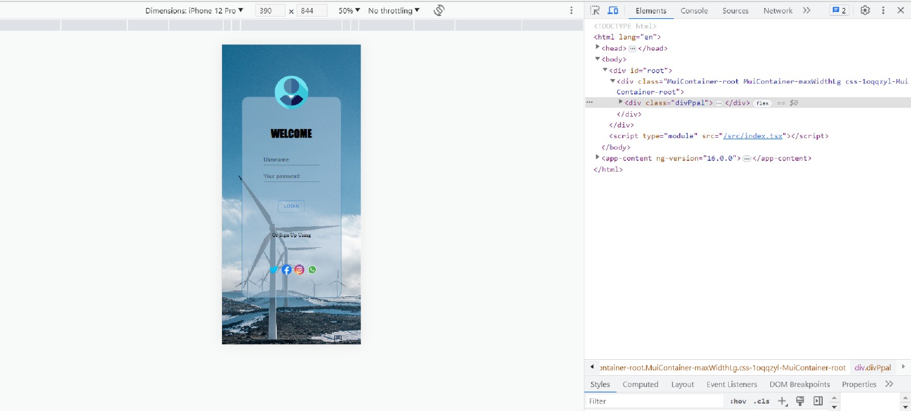
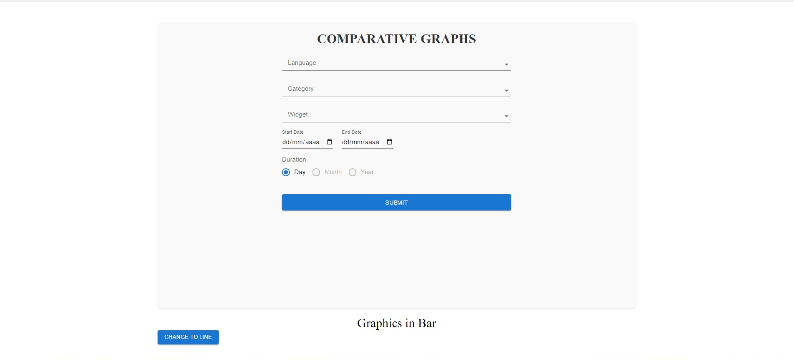
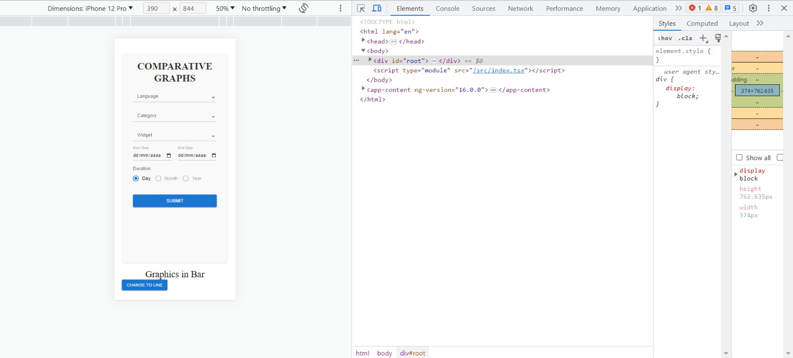
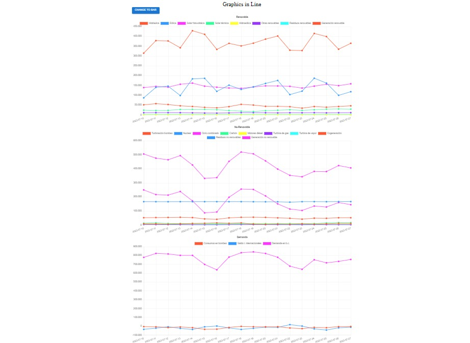
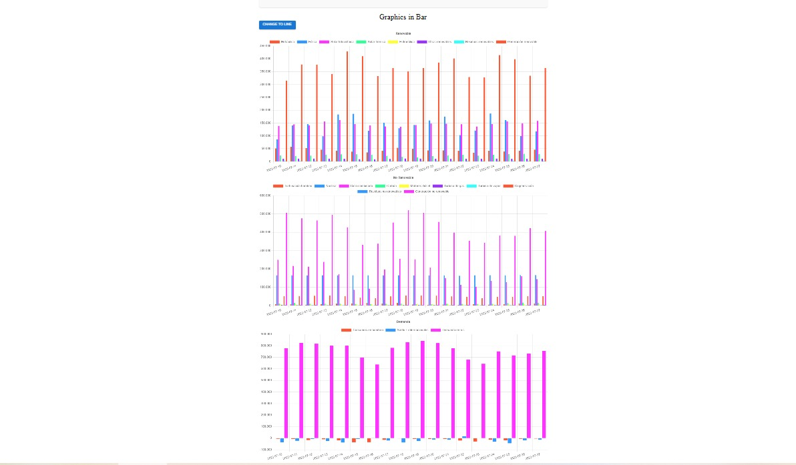

# Prueba Técnica de Teresa

DEFINICION

Para la realización de este proyecto he utilizado para montar el proyecto Vite, React, Context-API, TypeScript....

Decidí usar Vite, por su velocidad y ligereza. Es una de las opciones recomendadas por la Documentación Oficial de React.

FUNCIONAMIENTO

Esta prueba está desarrollada en React con Vite, por lo que para la instalación de dependencias es necesario tener Node y Vite. Una vez instalados ambos, desde la raíz del proyecto ejecuta "npm install" para instalar todas las dependencias necesarias.

LOGIN

Para iniciar sesión en necesario poner en el nombre de usuario:"mor*2314" y en la contraseña: "83r5^\_*", como indicamos en el Login.tsx.

ARRANCAR EN LOCAL

Para ejecutar el proyecto en el puerto 3000 es necesario ir a la raíz del proyecto y ejecutar "npm start". Si vas a localhost:3000, Verás la aplicación.

CAPTURAS DE PANTALLA

